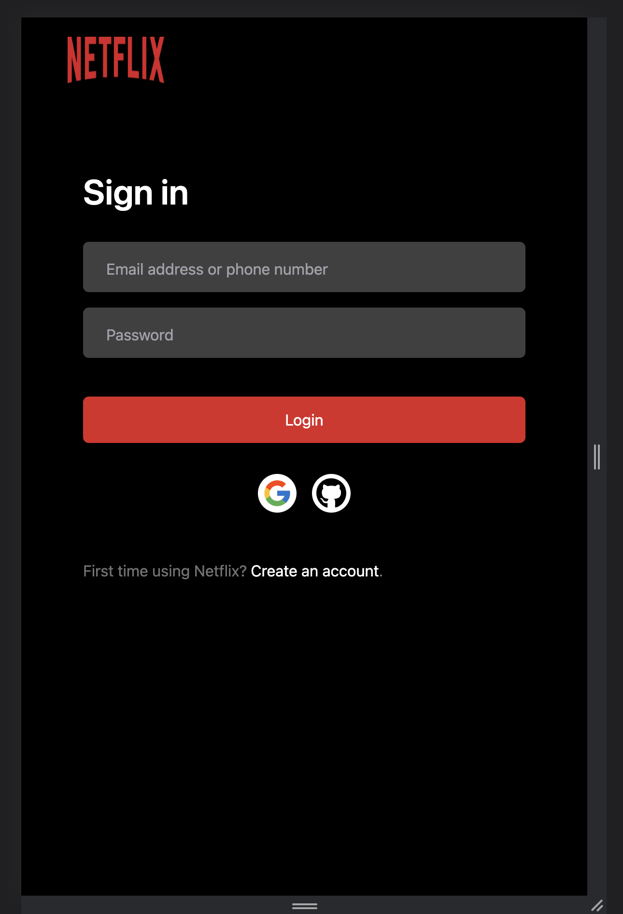
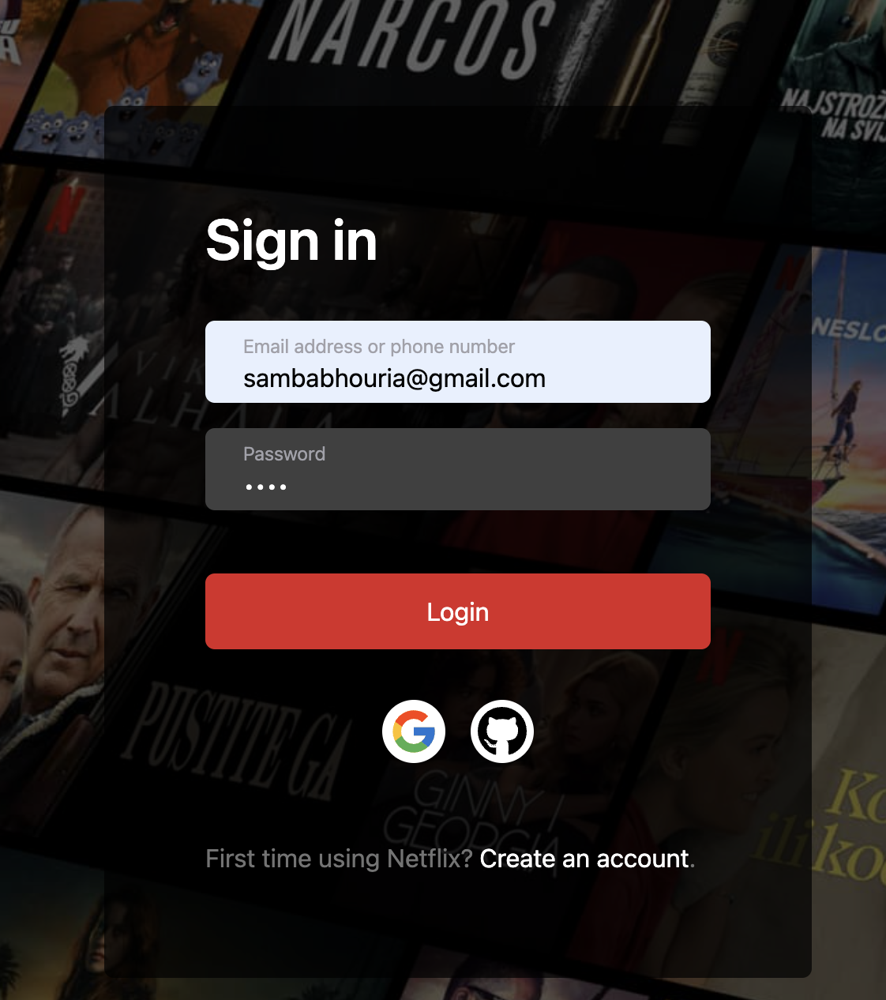
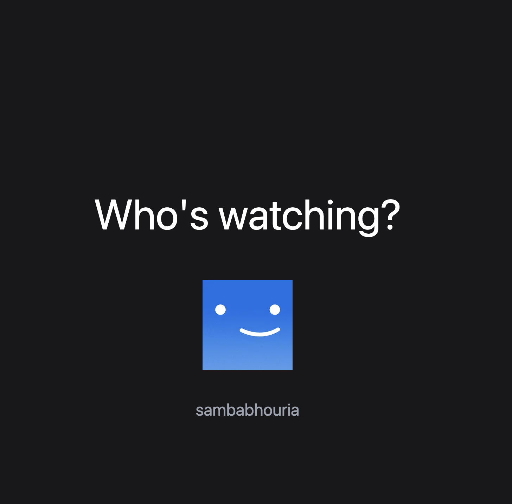
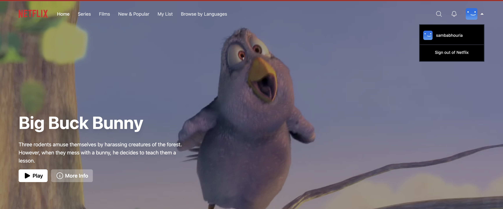
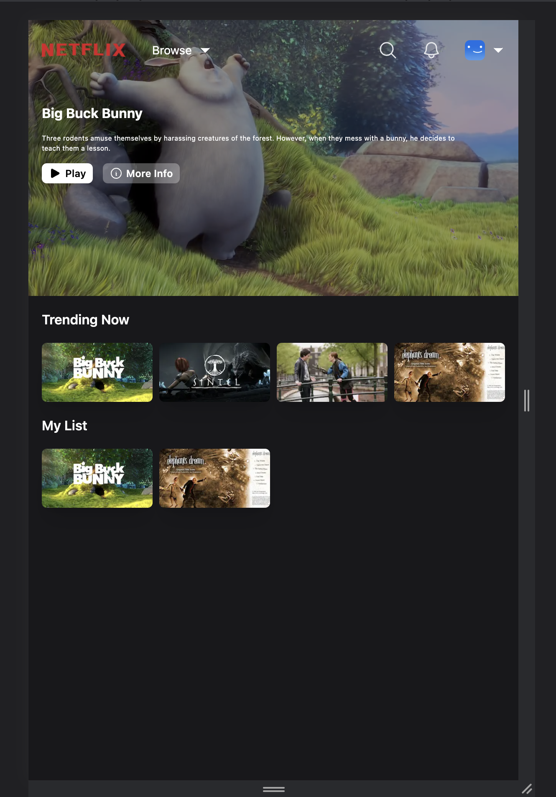

# Building a Fullstack Netflix Clone with React, NextJS, TailwindCSS & Prisma

Netflix Clone
Master Full Stack Netflix Clone development with Next.js 12, React, Tailwind, Prisma, and MongoDB.
This is a repository for a FullStack Netflix Clone using React, NextJS, TailwindCSS & Prisma.

# Features:

⚙️ 💾 Environment, Typescript, NextJS Setup

MongoDB & Prisma connect, Database creation
Authentication with NextAuth, Google & Github Login
Full responsiveness on all pages
Cookie based authentication
API and Controllers creation
Detail-oriented effects and animations using TailwindCSS
React SWR data fetching
Zustand state management

🛰️ 🌐 🗄 📡 Technologies
Next 12 (Pages routing)
React
Tailwind
Prisma
MongoDB

🔐 Setup .env file
DATABASE_URL=
GOOGLE_CLIENT_ID=
GOOGLE_CLIENT_SECRET=
GITHUB_ID=
GITHUB_SECRET=
NEXTAUTH_JWT_SECRET=
NEXTAUTH_SECRET=

💻 Screen Shoo t💻

